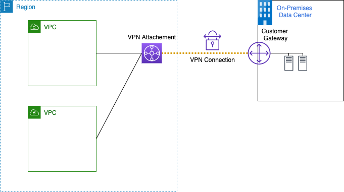
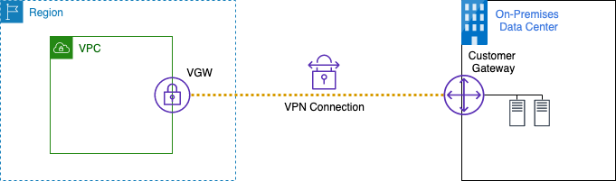

## AWS VPN configuration to support NCSC VPN guidance

This repository provides two CloudFormation templates which configure the AWS Site-to-Site VPN service in line with the recommendations set out by the [National Cyber Security Centre](https://www.ncsc.gov.uk/).

## Architecture

Two templates are provided to offer different deployment options. The first template's service connect to an existing [AWS Transit Gateway](https://aws.amazon.com/transit-gateway/) service. The second terminates the VPN connection on a [Virtual private gateway](https://aws.amazon.com/vpn/faqs/#Virtual_private_gateway). Both options provide the same IPSec tunnel configuration parameters

The main configuration values of interest to support NCSC guidance are:

| **Configuration parameter** | **Value** |
| :------ | :------ |
|IKEv2|AES-256-GCM|
|IKEv2 - Pseudo-random function|HMAC-SHA256|
|IKEv2 - Diffie-Hellman Group |19|
|IKEv2 – Authentication|RSA 2048 SHA2-512|
|ESP - Encryption|AES-256-GCM|

### Option 1 - AWS Transit Gateway (TGW) VPN (recommended)

The first option will deploy a TGW VPN as per https://docs.aws.amazon.com/vpc/latest/tgw/tgw-vpn-attachments.html. This solution has some advantages the main being:

- Allows easy access from multiple VPC's
- Allows the use of ECMP allowing multiple tunnels to be used increasing bandwidth

### Option 2 - AWS VPC VPN

The second option will deploy a VPC VPN as per https://docs.aws.amazon.com/vpn/latest/s2svpn/SetUpVPNConnections.html#vpn-create-target-gateway.

## Deployment

### Prerequisites

- To support certificates with the AWS Site-to-Site VPN service users will first need to create a subordinate certificate authority using [AWS Certificate Manager Private Certificate Authority](https://aws.amazon.com/certificate-manager/private-certificate-authority/). The following guides can be used to setup the CA and issue the certificate.

- Create private subordinate CA and (if required) root CA by following the section "Procedures for Creating a CA" as docuemted [here](https://docs.aws.amazon.com/acm-pca/latest/userguide//PcaCreateCa.html#CA-procedures)

- If you didn't complete in the step above you must create the CA certificates by following the documentation, [Create private subordinate CA and (if required) root CA](https://docs.aws.amazon.com/acm-pca/latest/userguide//PCACertInstall.html#InstallSubordinateExternal)

- [Issue private RSA 2048 certificate for the VPN](https://docs.aws.amazon.com/acm/latest/userguide/gs-acm-request-private.html)

**Note:** copy the certificate arn from the certificate you just issued as you will need it in a later step.

### CloudFormation

First select which template best meets you requirement:

- [TGW deployment](CloudFormation/vpn-tgw-product.yaml)
- [VPC deployment](CloudFormation/vpn-vpc-product.yaml)

Once you have selected the design pattern follow the guide to [create your stack](https://docs.aws.amazon.com/AWSCloudFormation/latest/UserGuide/cfn-console-create-stack.html).

During the stack creation process you will need to provide the following values:

| **Parameter** | **Value** |
| :------ | :------ |
|OnPremIP|The IP address for your on premises VPN termination device|
|PrivCert|The arn of the certificate you issued during the prerequisite setup|

Depending on the deployment type you created you will also have to provide one of the following values.

| **Parameter** | **Value** |
| :------ | :------ |
|TGW|The ID or your TGW|
|VPC|The ID of your VPC|

## Security

See [CONTRIBUTING](CONTRIBUTING.md#security-issue-notifications) for more information.

## License

This library is licensed under the MIT-0 License. See the LICENSE file.

